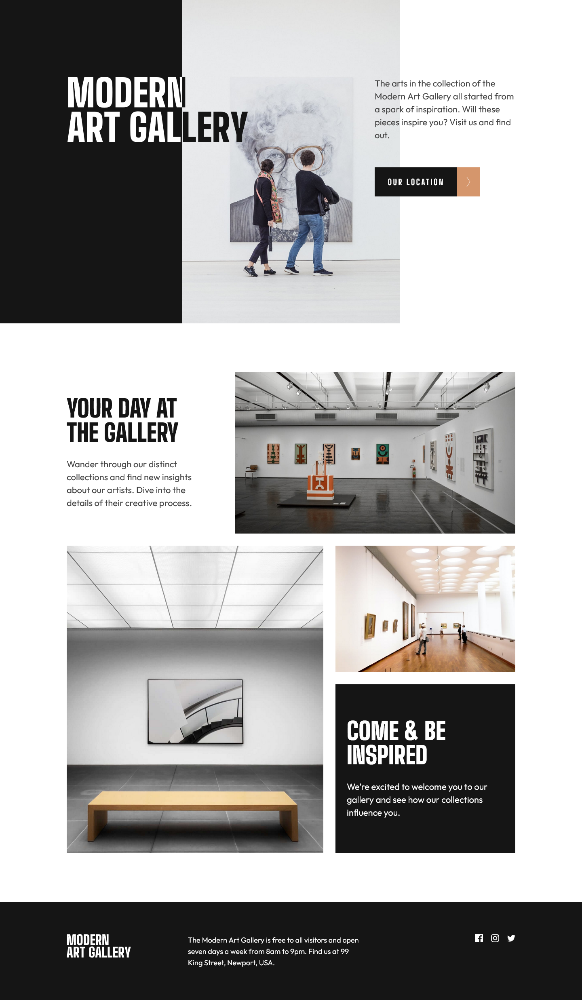

# Frontend Mentor - Art gallery website solution

This is a solution to the [Art gallery website challenge on Frontend Mentor](https://www.frontendmentor.io/challenges/art-gallery-website-yVdrZlxyA). Frontend Mentor challenges help you improve your coding skills by building realistic projects.

### Screenshot

### Links

- Solution URL: [Solution URL here](https://github.com/NDK1195/art-gallery-website)
- Live Site URL: [Live site URL here](https://ndk1195.github.io/art-gallery-website/)

### Built with

- HTML5
- Tailwind CSS
- Leaflet JS
